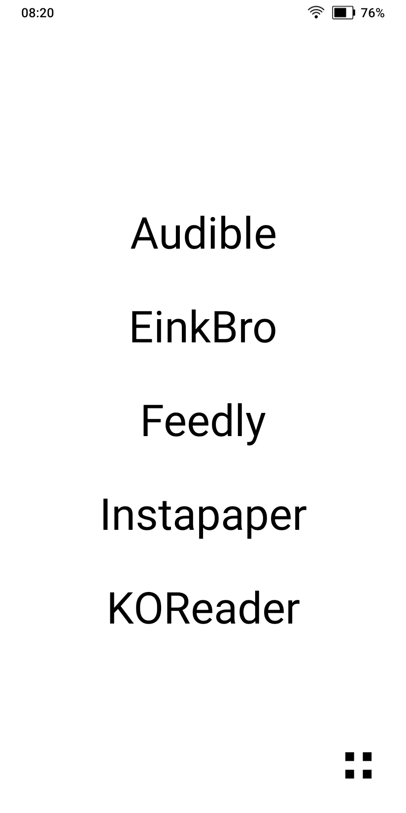
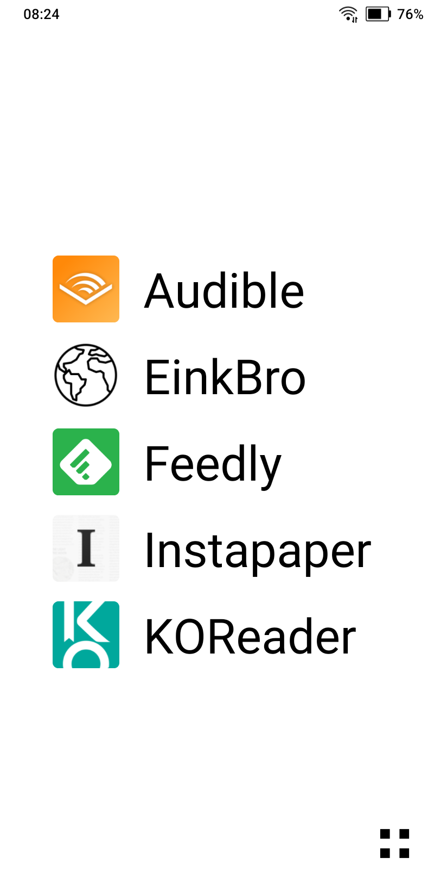
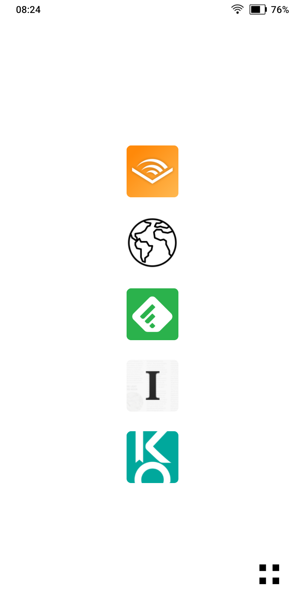
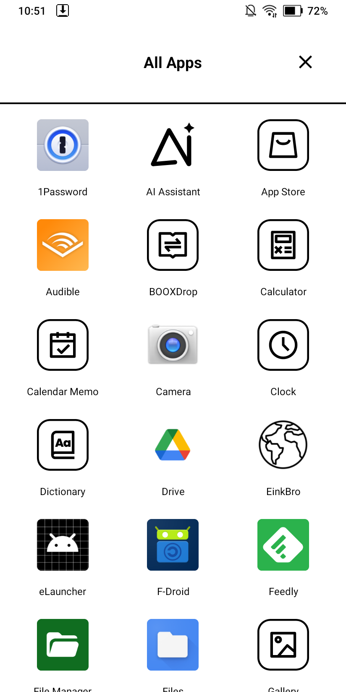
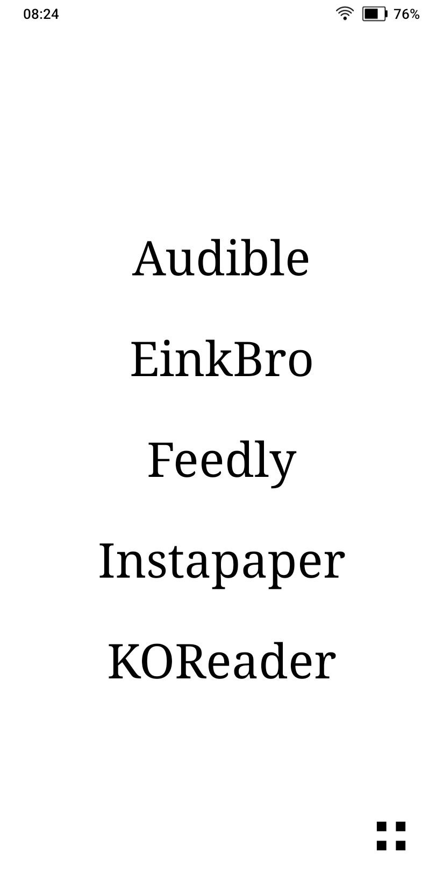

# BW-Launch

A minimalist Android launcher optimized for e-ink displays, specifically designed for the Boox Palma.

## Screenshots

<p align="center">
  
  
  
</p>

<p align="center">
  
  
</p>

## Features

- **Three Display Modes**: Text-only (default), Icons+Text, or Icons-only
- **Configurable Favorites**: Display 1-10 favorite apps on the home screen
- **E-ink Optimized**: Pure white/black UI with minimal animations
- **Scheduled Dark Mode**: Automatic theme switching based on time
- **Custom Labels**: Long-press apps to edit their display names
- **All Apps Drawer**: Full-screen overlay for accessing all installed apps

## E-ink Optimizations

- Disabled all animations to reduce ghosting
- Uses DiffUtil for efficient list updates (only redraws changed items)
- High contrast black/white theme
- Large touch targets for easier interaction
- Cached app loading to minimize refreshes

## Usage

### Home Screen
- **Tap** an app to launch it
- **Long-press** an app to edit its label
- **Long-press** empty space to open Settings
- **Tap "All Apps"** to open the app drawer

### Settings
- Choose display mode (text/icons+text/icons)
- Set number of favorite apps (1-10)
- Toggle dark mode
- Configure scheduled dark mode times
- Select favorite apps

## Building

```bash
./gradlew assembleDebug
```

Install the APK:
```bash
adb install app/build/outputs/apk/debug/app-debug.apk
```

## Technical Details

- **Min SDK**: 28 (Android 9)
- **Target SDK**: 33 (optimized for Boox devices)
- **Language**: Kotlin
- **Architecture**: Single Activity with overlay drawer

## License

MIT License
